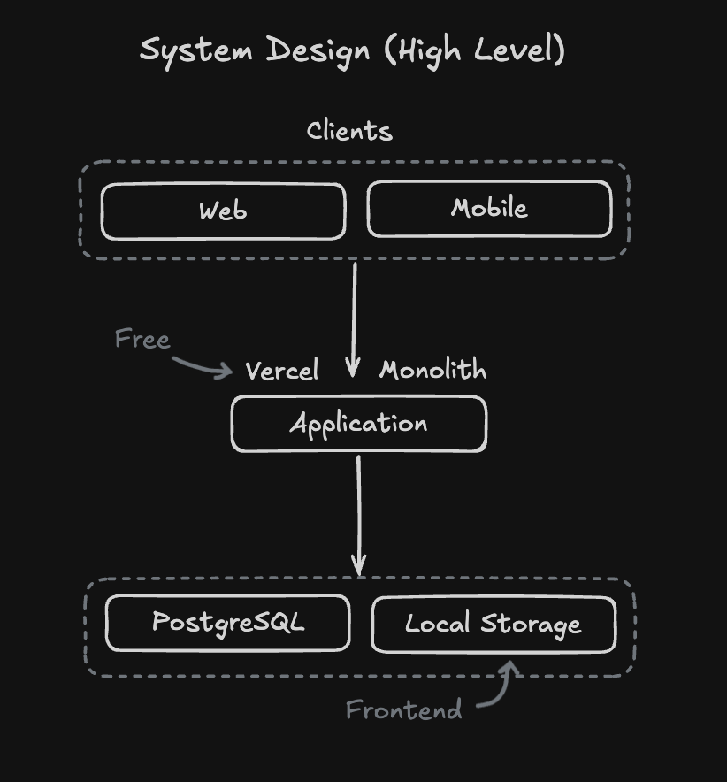
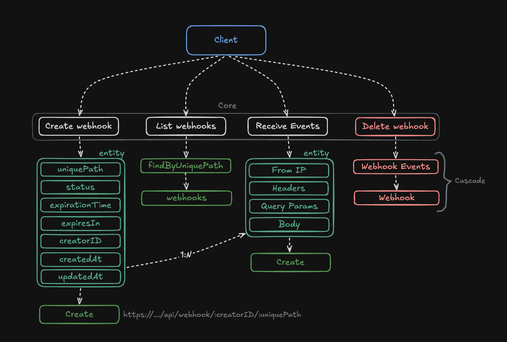

# Webhook Inspector
Create a temporary webhook to receive events.

# What is a webhook?
A webhook is an API call in reverse: instead of you constantly asking "is there anything new?", the server calls us when an event occurs.

# System Design

# Flows

# Difference between Polling and Webhooks

* Polling – Calls the API every 2 minutes to get result X.
* Webhook – We receive the call when the event occurs.

### Observação

Hand-built without the use of AI. 